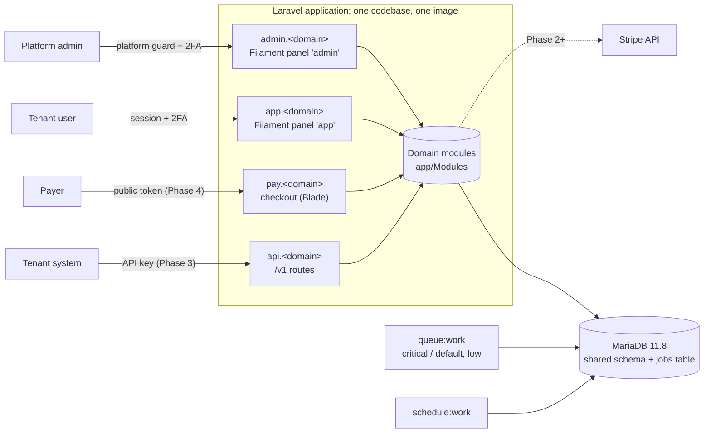

# Architecture

AxisPay is a **modular monolith** (ADR-0001): one Laravel application, one MariaDB database shared by every tenant (ADR-0002), and background work on database queues (ADR-0016).

- The application serves four surfaces, each on its own host.
- Tenant isolation is enforced in layers, so one mistake does not leak data.

This page describes what exists **today (Phases 0–1)** and marks what is planned. The plan ([`plans/master.md`](plans/master.md)) stays the source of truth.

## At a glance

## Surfaces and hosts

Each surface is bound to its host with `Route::domain()`. The hosts come from `config/axispay.php` → `surfaces` (`AXISPAY_*_HOST`; ADR-0027).

| Surface | Host | Status | Entry point | Auth |
|---|---|---|---|---|
| Public API v1 | `api.` | Group registered; endpoints in Phase 3 | `bootstrap/app.php` (`routes/api.php`, prefix `/v1`) | API key (Phase 3) |
| Tenant panel | `app.` | Implemented | `app/Providers/Filament/AppPanelProvider.php`, plus `routes/web.php` (invitations, impersonation hand-off, test/live selector) | `web` guard, session, 2FA policy |
| Platform panel | `admin.` | Implemented | `app/Providers/Filament/AdminPanelProvider.php` | `platform` guard, mandatory 2FA |
| Checkout | `pay.` | Phase 4 | none yet | public token |

Host-independent routes:

- `/up`: health, registered without a domain, so it answers on any host.
- `POST /locale`: the language switcher.
- `/`: the welcome page.

### Request flow per surface

- **Every request.** Global middleware runs first:
  - `AssignRequestId` sets the `Request-Id` header and adds it to the log context.
  - `UseSurfaceSessionCookie` picks the session cookie for the host: `axispay_admin_session` or `axispay_app_session`.
  - Laravel's `TrustProxies` reads `config/trustedproxy.php`.
  - At boot, `SharedServiceProvider` refuses to start when `SESSION_DOMAIN` is set (ADR-0034).
- **`app.`** Filament panel middleware (`App\Support\Filament\PanelDefaults`) → `Authenticate` → `ResolveTenantContext`, which sets the `TenantContext` from the signed-in user → `RequireTwoFactorForSensitiveUsers` → policies → Actions.
- **`admin.`** Filament panel middleware → `platform` guard → mandatory 2FA → policies. Cross-tenant reads run inside `TenantContext::runAsPlatform()`, which is audited.
- **`api.`** The `api` middleware group. The API error envelope (plan 10.4) is rendered by `ApiErrorRenderer` only for requests on this host (`ApiSurface::matches()`).
- **Queued jobs.** A tenant job implements `TenantAware` and uses `CapturesTenantContext`. The `RestoreTenantContext` job middleware re-enters the same tenant and mode. A tenant job without a context fails.

## Modules

Code lives in `app/Modules/<Module>/`. The full map and the entry points are in [`app/Modules/README.md`](../app/Modules/README.md).

| Module | Status | Responsibility |
|---|---|---|
| `Shared` | Phase 0 | Money (brick/money), prefixed ULIDs, schema macros, API errors, request IDs, log and Sentry redaction |
| `Tenancy` | Phase 1 | `Tenant`, `TenantContext`, `BelongsToTenant` / `BelongsToMode`, tenant states, test/live selector, `TenantLock` |
| `Identity` | Phase 1 | Tenant users, sign-in, TOTP 2FA, invitations, re-authentication, deactivation |
| `Access` | Phase 1 | Permission catalog (`TenantPermission`), system roles (`SystemRole`), policies, `RoleGrantGuard`, `OwnerGuard` |
| `PlatformAdmin` | Phase 1 | `PlatformAdmin`, tenant management, audited impersonation |
| `Audit` | Phase 1 | Append-only `audit_logs`; `AuditLogger` is the only writer |
| `Gateways`, `ProviderEvents` | Phase 2 | Stripe port/adapter, connections, incoming webhooks |
| `ApiKeys`, `PaymentLinks` | Phase 3 | API keys, idempotency, links |
| `Checkout`, `Payments` | Phase 4 / 7 | Hosted checkout, attempts, refunds, disputes |
| `Webhooks` | Phase 5 | Outgoing webhooks, outbox, SSRF protection, pre-payment validation |
| `Fx` | Phase 6 | Banxico rates, quotes, conversion policy |
| `Branding`, `PayerFields`, `Reporting`, `Billing`, `Notifications` | Phase 8 / 9 | See the plan |

Business logic lives in single-purpose Actions with DTOs, never in controllers or Filament resources (rules.md rule 12).

## Tenancy: defense in layers

| Layer | Where | What it prevents |
|---|---|---|
| Tenant context | `App\Modules\Tenancy\TenantContext` (scoped binding, reset per request and per job) | Reading tenant data with no known tenant: it throws `MissingTenantContextException` |
| Fail-closed global scopes | `Concerns\BelongsToTenant` + `Scopes\TenantScope`; `Concerns\BelongsToMode` + `Scopes\ModeScope` | Queries that forget `tenant_id` or `livemode`; writing a row for another tenant (`TenantMismatchException`) |
| Single table list | `config/tenancy.php` → `tenant_tables`, `team_scoped_tables`, `scope_bypass_whitelist` | Drift between the schema, the models and the static rule |
| Composite foreign keys | Migrations, e.g. `['tenant_id', 'user_id'] → users(['tenant_id', 'id'])` | A row that references another tenant's row |
| Static analysis | PHPStan rule `Tests\PHPStan\Rules\TenantTableAccessRule` (`axispay.tenantTableAccess`, `axispay.rawTenantSql`, `axispay.scopeBypass`) | `DB::table()` or raw SQL on tenant tables; `withoutGlobalScope(s)` outside the whitelist |
| Tests | `tests/Feature/Isolation/TenantIsolationTest.php` (cross-tenant access → 404, route coverage), `tests/Feature/Tenancy/TenancyInventoryTest.php` (every `tenant_id` table is listed and its model uses the trait) | New endpoints or tables without isolation |
| Explicit platform context | `TenantContext::runAsPlatform($reason, …)` (audited) and `runAsTenant()` | Silent cross-tenant access |

Business tables (links, payments; Phase 3+) also carry `livemode`, so test and live data never mix (rules.md rule 4).

## Identity, access and 2FA

| Topic | Implementation |
|---|---|
| Users | Tenant users (`Identity\Models\User`, ULID, one tenant per user, e-mail unique across the platform) and platform admins (`PlatformAdmin\Models\PlatformAdmin`, own table and `platform` guard) |
| RBAC | spatie/laravel-permission with teams (team = tenant). Policies check permissions, never role names (ADR-0014). The system roles are `owner`, `admin`, `integration_manager`, `finance`, `link_creator` and `viewer`, seeded by `PermissionCatalogSeeder` (idempotent, run on every deploy). |
| No escalation | `Access\Services\RoleGrantGuard`: an actor grants only roles whose permissions it holds. `OwnerGuard` keeps at least one active owner. Tenant-wide checks lock the tenant row first (`TenantLock`). |
| 2FA policy | **Mandatory** for every platform admin, and for tenant users who hold a sensitive permission (`TenantPermission::isSensitive()`: payments refund, API keys, webhooks, gateway and user management). By role, that is owner, admin, integration_manager and finance. Enforced by `RequireTwoFactorForSensitiveUsers`. **Optional** for other users (Profile page). TOTP with recovery codes, encrypted. |
| Re-authentication | Sensitive actions ask for the password or a 2FA code again. It is valid for 10 minutes (`Identity\Actions\Reauthenticate`, `ReauthenticationWindow`). |
| Invitations | Signed, single-use, 72 h, throttled per tenant (ADR-0032, ADR-0034) |
| Impersonation | Admin host → single-use hand-off link → app host. Read-only, 30 minutes, banner, audited, re-validated on every request (ADR-0033) |
| Sign-in throttling | 5 failures per account in 15 minutes, on top of Filament's per-IP limit |

## Audit

`Audit\Services\AuditLogger` writes `audit_logs`:

- **Append-only.** Model guards plus two database triggers reject `UPDATE` and `DELETE`.
- **Redacted details.** It uses the same `Redactor` as the logs.
- **Request metadata** is recorded with each entry.
- **Actions** are enumerated in `Audit\Enums\AuditAction`: sign-ins, 2FA changes, invitations, role changes, tenant lifecycle, impersonation, and platform-context entries.

## Panels and theming

- Two Filament 5 panels, `admin` and `app` (ADR-0025). They share `App\Support\Filament\PanelDefaults` for the login page, profile, MFA, middleware and render hooks.
- The theme is built from the design tokens (`resources/css/tokens/`):
  - `DesignTokenPalette` builds the Filament palettes from `primitives.css`.
  - `resources/css/filament/theme.css` is the panel theme.
  - A dark-mode bridge keeps Filament and the design system in sync (ADR-0030).
- Mukta (text) and Geist Mono (currency and numeric data, ADR-0042) are self-hosted through `laravel-vite-plugin` fonts (`ViteFontProvider` in the panels), so no font CDN is used.
- Frontend rules: [`frontend/README.md`](frontend/README.md).

## Internationalization

- English and Spanish (`lang/en`, `lang/es`).
- `App\Http\Middleware\SetLocale` resolves the locale in this order: `?lang=` query, `locale` cookie, `Accept-Language` header, then `app.locale`.
- Details: [`frontend/i18n.md`](frontend/i18n.md).

## Data conventions

| Topic | Rule | Where |
|---|---|---|
| Primary keys | ULIDs; API IDs are prefixed (`plink_`, `pay_`, …) | `Shared\Ids`, `Database\HasUlidPrimaryKey`, `HasPrefixedId` (ADR-0020) |
| Collations | `utf8mb4_uca1400_ai_ci` by default; `ascii_bin` for ULIDs, tokens, hashes, idempotency keys and provider IDs | `Shared\Database\SchemaMacros` (`ulidAscii`, `foreignUlidAscii`, `asciiString`, `asciiChar`, `->asciiBin()`) |
| Datetimes | `DATETIME(6)` in UTC; the session time zone is `+00:00` | `config/database.php`, `UsesMicrosecondDates` |
| Money | `BIGINT` minor units + `CHAR(3)` currency; decimal strings in the API; `HALF_UP` once; rates `DECIMAL(18,6)` | `Shared\Money` (ADR-0007) |
| Database users | `axispay_app` (DML) at runtime; `axispay_migrator` (DDL) for migrations only | `mariadb` / `mariadb_migrator` connections |

## Runtime and deployment

- A single image serves every role (`web`, `worker`, `scheduler`, `release`, and `all-in-one` for staging and local servers, ADR-0039): Nginx + PHP-FPM with no Octane, JSON logs to stderr, and runtime caches built at start (ADR-0035).
- Production runs on Dokploy with one Application per role (ADR-0036). The guide is [`deployment/dokploy.md`](deployment/dokploy.md); staging and local servers can use [`deployment/dokploy-all-in-one.md`](deployment/dokploy-all-in-one.md).
