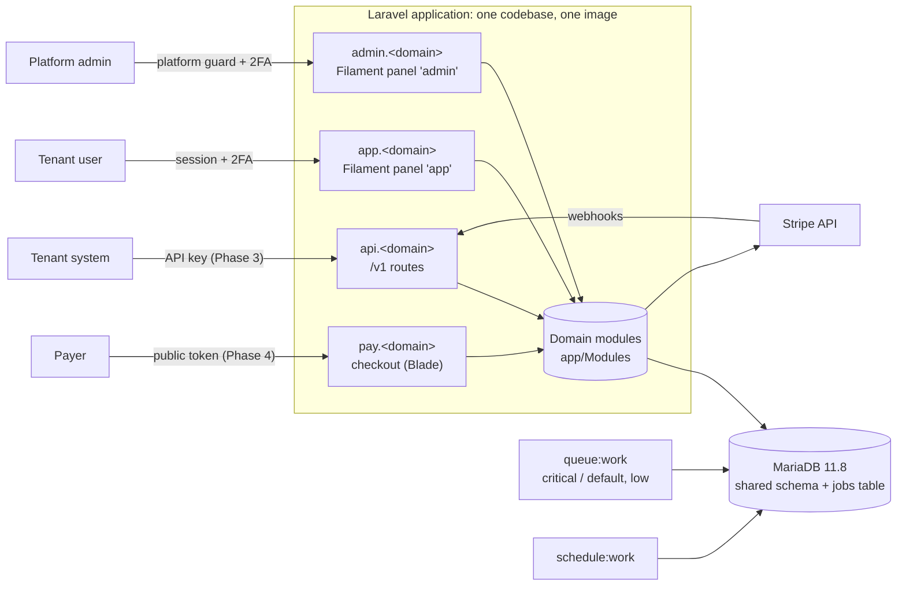

# Architecture

AxisPay is a **modular monolith** (ADR-0001): one Laravel application, one MariaDB database shared by every tenant (ADR-0002), and background work on database queues (ADR-0016).

- The application serves four surfaces, each on its own host.
- Tenant isolation is enforced in layers, so one mistake does not leak data.

This page describes what exists **today (Phases 0–4)** and marks what is planned. The plan ([`plans/master.md`](plans/master.md)) stays the source of truth.

## At a glance

```mermaid
flowchart LR
    integrator[Tenant system] -- "API key (Phase 3)" --> api
    payer[Payer] -- "public token (Phase 4)" --> pay
    user[Tenant user] -- "session + 2FA" --> app
    staff[Platform admin] -- "platform guard + 2FA" --> admin

    subgraph laravel[Laravel application: one codebase, one image]
        api["api.&lt;domain&gt;<br/>/v1 routes"]
        pay["pay.&lt;domain&gt;<br/>checkout (Blade)"]
        app["app.&lt;domain&gt;<br/>Filament panel 'app'"]
        admin["admin.&lt;domain&gt;<br/>Filament panel 'admin'"]
        modules[(Domain modules<br/>app/Modules)]
        api & pay & app & admin --> modules
    end

    modules --> db[(MariaDB 11.8<br/>shared schema + jobs table)]
    workers[queue:work<br/>critical / default, low] --> db
    scheduler[schedule:work] --> db
    modules --> stripe[Stripe API]
    stripe -- "webhooks" --> api
```

## Surfaces and hosts

Each surface is bound to its host with `Route::domain()`. The hosts come from `config/axispay.php` → `surfaces` (`AXISPAY_*_HOST`; ADR-0027).

| Surface | Host | Status | Entry point | Auth |
|---|---|---|---|---|
| Public API v1 | `api.` | Payment links (Phase 3) | `bootstrap/app.php` (`routes/api.php`, prefix `/v1`) | API key (`Authorization: Bearer axp_…`) |
| Tenant panel | `app.` | Implemented | `app/Providers/Filament/AppPanelProvider.php`, plus `routes/web.php` (invitations, impersonation hand-off, test/live selector) | `web` guard, session, 2FA policy |
| Platform panel | `admin.` | Implemented | `app/Providers/Filament/AdminPanelProvider.php` | `platform` guard, mandatory 2FA |
| Checkout | `pay.` | Implemented (Phase 4) | `bootstrap/app.php` (`routes/checkout.php`, `web` group) | public link token; anonymous session for CSRF |

Host-independent routes:

- `/up`: health, registered without a domain, so it answers on any host.
- `POST /locale`: the language switcher.
- `/`: the welcome page.

### Request flow per surface

- **Every request.** Global middleware runs first:
  - `AssignRequestId` sets the `Request-Id` header and adds it to the log context.
  - `UseSurfaceSessionCookie` picks the session cookie for the host: `axispay_admin_session` or `axispay_app_session`.
  - Laravel's `TrustProxies` reads `config/trustedproxy.php`.
  - At boot, `SharedServiceProvider` refuses to start when `SESSION_DOMAIN` is set (ADR-0034).
- **`app.`** Filament panel middleware (`App\Support\Filament\PanelDefaults`) → `Authenticate` → `ResolveTenantContext`, which sets the `TenantContext` from the signed-in user → `RequireTwoFactorForSensitiveUsers` → policies → Actions.
- **`admin.`** Filament panel middleware → `platform` guard → mandatory 2FA → policies. Cross-tenant reads run inside `TenantContext::runAsPlatform()`, which is audited.
- **`pay.`** The `web` group (anonymous session with its own cookie, CSRF on the POST endpoints) → the checkout's security headers (nonce-based CSP, no framing, no Referer, no-store, noindex) → the link is found by its public token through `PaymentLinkLookup` and the tenant context of that link is set → Actions (ADR-0051). An invalid token always answers the same 404 page.
- **`api.`** The `api` middleware group → API key (sets the tenant and the mode from the key) → rate limit per key → scope → idempotency on POST → controller → Action (ADR-0048). The API error envelope (plan 10.4) is rendered by `ApiErrorRenderer` only for requests on this host (`ApiSurface::matches()`).
- **Queued jobs.** A tenant job implements `TenantAware` and uses `CapturesTenantContext`. The `RestoreTenantContext` job middleware re-enters the same tenant and mode. A tenant job without a context fails.

## Modules

Code lives in `app/Modules/<Module>/`. The full map and the entry points are in [`app/Modules/README.md`](../app/Modules/README.md).

| Module | Status | Responsibility |
|---|---|---|
| `Shared` | Phase 0 | Money (brick/money), prefixed ULIDs, schema macros, API errors, request IDs, log and Sentry redaction |
| `Tenancy` | Phase 1 | `Tenant`, `TenantContext`, `BelongsToTenant` / `BelongsToMode`, tenant states, test/live selector, `TenantLock` |
| `Identity` | Phase 1 | Tenant users, sign-in, TOTP 2FA, invitations, re-authentication, deactivation |
| `Access` | Phase 1 | Permission catalog (`TenantPermission`), system roles (`SystemRole`), policies, `RoleGrantGuard`, `OwnerGuard` |
| `PlatformAdmin` | Phase 1 | `PlatformAdmin`, tenant management, audited impersonation, platform permission catalog (`PlatformPermission`, derived from `PlatformRole`) |
| `Branding` | Phase 4 (ADR-0053) / 8 | Platform logo (`platform_logos`, PNG bytes in the DB), favicon (`platform_favicons`, 32/180/192 px) and display mode (`platform_settings`), `PlatformBrand` (cached state), `ImageNormalizer` (GD re-encoding, shared with Phase 8 tenant logos), same-origin logo and favicon routes on the admin/app/pay hosts without session middleware |
| `Audit` | Phase 1 | Append-only `audit_logs`; `AuditLogger` is the only writer |
| `Gateways`, `ProviderEvents` | Phase 2 | Stripe port/adapter, connections, incoming webhooks |
| `ApiKeys`, `PaymentLinks` | Phase 3 | API access (keys, authentication, scopes, rate limit, idempotency); payment links, their state machine and expiration |
| `Checkout` | Phase 4 | Payment page, payment flow (authorize, validation hook, capture), card-testing protection, openings, sandbox demo |
| `Payments` | Phase 4 / 7 | Payment attempts and their state machine, applying the gateway's state, capture and void, reconciliation; refunds and disputes in Phase 7 |
| `PayerFields` | Phase 4 / 8 | Payer field catalog and validation (Phase 4); tenant configuration UI and purge (Phase 8) |
| `Webhooks` | Phase 4 / 5 | Recorded business events (Phase 4); outgoing webhooks, outbox delivery, SSRF protection, pre-payment validation (Phase 5) |
| `Fx` | Phase 6 | Banxico rates, quotes, conversion policy |
| `Branding`, `Reporting`, `Billing`, `Notifications` | Phase 8 / 9 | See the plan |

Business logic lives in single-purpose Actions with DTOs, never in controllers or Filament resources (rules.md rule 12).

## Tenancy: defense in layers

| Layer | Where | What it prevents |
|---|---|---|
| Tenant context | `App\Modules\Tenancy\TenantContext` (scoped binding, reset per request and per job) | Reading tenant data with no known tenant: it throws `MissingTenantContextException` |
| Fail-closed global scopes | `Concerns\BelongsToTenant` + `Scopes\TenantScope`; `Concerns\BelongsToMode` + `Scopes\ModeScope` | Queries that forget `tenant_id` or `livemode`; writing a row for another tenant (`TenantMismatchException`) |
| Single table list | `config/tenancy.php` → `tenant_tables`, `team_scoped_tables`, `scope_bypass_whitelist` | Drift between the schema, the models and the static rule |
| Composite foreign keys | Migrations, e.g. `['tenant_id', 'user_id'] → users(['tenant_id', 'id'])` | A row that references another tenant's row |
| Static analysis | PHPStan rule `Tests\PHPStan\Rules\TenantTableAccessRule` (`axispay.tenantTableAccess`, `axispay.rawTenantSql`, `axispay.scopeBypass`) | `DB::table()` or raw SQL on tenant tables; `withoutGlobalScope(s)` outside the whitelist |
| Tests | `tests/Feature/Isolation/TenantIsolationTest.php` (cross-tenant access → 404, route coverage), `tests/Feature/Tenancy/TenancyInventoryTest.php` (every `tenant_id` table is listed and its model uses the trait) | New endpoints or tables without isolation |
| Explicit platform context | `TenantContext::runAsPlatform($reason, …)` (audited) and `runAsTenant()` | Silent cross-tenant access |

Business tables (API keys, idempotency records and links since Phase 3; payment attempts and business events since Phase 4) also carry `livemode`, so test and live data never mix (rules.md rule 4).

## Payments (Phase 4)

How a link gets paid (ADR-0050, ADR-0051):

| Step | Rule |
|---|---|
| Page | The link's state decides the page; an active link past its expiry is expired on opening; openings are counted (previewers excluded) |
| Pay | Payer fields, rate limits, Turnstile after a decline (checked on the server), the card behind the confirmation token, the amount to charge |
| Attempt | Under the link's lock, the link's single active attempt is reused or created (unique in the database) and leased, and the link is reserved (`processing`), so a second tab waits and the link cannot expire or be canceled mid-payment |
| Authorize | The Stripe payment is created with manual capture and confirmed with stable idempotency keys; 3D Secure runs in the page |
| Validate | The pre-payment validation extension point runs with no lock or transaction open (not configured in Phase 4); the decision is kept on the attempt |
| Capture or void | Approved → captured; rejected → the authorization is voided, nothing charged |
| Truth | Every Stripe state goes through one action; Stripe's events (re-read, never trusted) and the 15-minute reconciliation keep the database right; authorizations left uncaptured are voided |

Attempts, declines and payer data are tenant tables; payer data is encrypted. Business events (`payment_link.opened`, `payment.processing`, `payment.failed`, `payment.succeeded`, `payment.canceled`, `payment_link.paid`) are recorded in the same transaction for Phase 5's webhooks, as frozen snapshots (the link as `PaymentLinkPresenter` shows it, the payment as `PaymentSnapshot` builds it, which also feeds `GET /v1/payments`). `ApplyProviderPayment` records `payment.canceled` whenever an authorized payment or a 3D Secure step is reported canceled, with the `VoidReason` of our void or `gateway_canceled` when the gateway released it on its own (ADR-0062).

### Payment mechanics (technical detail of ADR-0051)

ADR-0051 states the business rules; this is how the code keeps them.

| Topic | Mechanism |
|---|---|
| Module split | `Checkout\Actions\StartCheckoutPayment` orchestrates; the Payments module owns the attempt: `ClaimLinkAttempt` (claim under the link lock, lease, payer details via `StorePayerDetails`), `ConfirmAttemptPayment` (create/update/confirm), `CaptureAuthorizedPayment`, `VoidAuthorization`, `ApplyProviderPayment` (the single place a gateway state is applied), `SyncPaymentAttempt`, `ReleaseLinkAfterAttempt`. |
| One active attempt | Unique index on the generated column `active_link_id` of `payment_attempts` (set while the status is active). |
| Lock order | `AttemptLocks::lockLinkThenAttempt()`: link row, then attempt row, `FOR UPDATE`, inside the caller's transaction. The attempt's link id is read before the transaction (`linkIdOf()`). |
| Snapshot isolation | MariaDB 11.8's `innodb_snapshot_isolation` refuses to lock a row changed after the transaction's first consistent read (ER_CHECKREAD, 1020). No plain read precedes a lock inside a transaction: the claim reads the active attempt id in autocommit, then locks the link and that attempt by key and re-checks it. Deadlocks, lock-wait timeouts and 1020 are retried three times in all with 5–20 ms jitter (`Shared\Database\ConcurrencyErrors`); the active-attempt range is never locked (gap locks between links of one tenant). |
| Lease | `AttemptLease`: `confirmation_lease_until` + owner token, 90 s at the default of 5 s; derived from the validation timeout (`ValidationTimeouts`, ADR-0061: the request budget + 40 s, so 115 s at the shipped 30 s); renewed (token-owned `extend()`, which stops if the lease was lost) right before the confirmation, the capture and the void. Right after each renewal the caller's budget is capped at the lease's end minus 5 s (`CallBudget::withinLease()`), so no gateway call or retry of a lease holder can run past its lease and overlap another actor. Only the holder may apply a "backward" state (`PaymentAttemptStateMachine::isBackward()`). |
| Bounded Stripe calls | `services.stripe`: 20 s per request, 5 s to connect, one SDK retry with the same idempotency key, at most 2 s between: 42 s worst case, below the lease. |
| Time budgets | `CallBudget`: a gateway call (and each `ServerErrorRetry` re-read and repetition) starts only if its worst case (`CallBudget::worstCallSeconds()`, 42 s) fits. **Payer requests** use `forPayerRequest()` (`checkout.request_budget_seconds`: the merchant validation timeout T + 45 s, so 75 s at the shipped T = 30 s and 50 s at T = 5 s; below nginx's `fastcgi_read_timeout` (budget + 10 s) and FPM's `request_terminate_timeout` (budget + 15 s), both written at container start from the same setting): the card read, create, update and confirm (`ConfirmAttemptPayment`, whose `ConfirmationRequest` requires a budget), the merchant's validation, the capture and the void (`CaptureAuthorizedPayment`, `VoidAuthorization`, through `CompleteCheckoutAuthorization::complete()`), and the status re-read (`SyncPaymentAttempt` from `ReadCheckoutStatus`, a budget per poll). Before the confirmation, out of time means an error with nothing charged; after it, "processing" (`PaymentOutcomeUnknownException` for a confirm that timed out, `CaptureOutcome::Pending` otherwise). **Jobs** use `forJob($timeout)` (the timeout minus 10 s): `CompleteAuthorizedPaymentJob`, `CloseAttemptOfClosedLinkJob`, `ProcessProviderEventJob` (through `ProcessProviderEvent`) and `ReconcilePaymentAttemptsJob` (one budget for the whole run), so a job's gateway time always ends before its worker kills it; `JobTimeoutsTest` checks each budget is below the timeout and fits one call plus the validation. Only the jobs that can run the merchant validation (`CompleteAuthorizedPaymentJob`, `ProcessProviderEventJob` and `ReconcilePaymentAttemptsJob`, both through `SyncPaymentAttempt`) take their timeout from `ValidationTimeouts`; `CloseAttemptOfClosedLinkJob` only voids and keeps 115 s. Every budget is also capped at the lease (row above). Whatever does not fit is left as it is and logged at warning level: the unique, delayed `CompleteAuthorizedPaymentJob` (one per attempt, `uniqueFor` 60 + 3 × timeout + 195 s, 600 s at T = 5 s), Stripe's event or the reconciliation picks it up (captured within the capture window, voided past it). |
| Idempotency keys | `IdempotencyKeys`: `create_pi:{attempt}` (fixed: creation carries only link-fixed values), `update_pi:{attempt}:{amount}{currency}`, `confirm:{attempt}:{sha256(token, receipt e-mail, return URL)}`, `capture:{attempt}`, `cancel:{attempt}`. |
| Stored 5xx | Stripe stores a 5xx under its key for 24 h. `ServerErrorRetry` (through `AttemptGateway::retryingCall()`): re-read the payment (`movedOn()`); if still due, repeat under `:r1`, `:r2`. |
| Unexpected state | `StripeGateway::callIntent()` re-reads and returns the payment on `payment_intent_unexpected_state` (confirm, capture, cancel); a declined confirm (402) is re-read with its failure. |
| Card only | `allowed_payment_method_types: ['card']` (2026-07-29.dahlia; `payment_method_types` is removed from 2026-08-26.preview); Stripe.js `allowedPaymentMethodTypes: ['card']`, `wallets: {applePay, googlePay, link: 'never'}`. |
| Failure kinds | `Gateways\Enums\ProviderFailureKind`, mapped from Stripe codes by `StripeFailureKinds`; stored as `last_failure_kind` / `payment_attempt_failures.kind`. |
| Gateway port additions | `confirmPayment()` takes the return URL; `capturePayment()`; `cancelPayment()` takes an idempotency key; `ProviderPaymentStatus` with `RequiresCapture`; `ProviderPayment` carries the client secret (only while the browser must act), the card preview (with fingerprint), the last failure (reference, codes, kind), the attempt reference, `captureBefore` and `createdAt`; one event kind `PaymentUpdated`. |
| Gateway events | `ProcessProviderEventJob` is `ShouldBeUnique` (unique id = stored event, `uniqueFor` 5 × timeout + 925 s (1500 s at T = 5 s) ≥ the sum over tries of max(timeout + backoff, `retry_after`)); `dispatchIfIdle()` hands the lock to the job. `axispay:provider-events:sweep` (5 min) and `:retry {id?} {--failed}`. Payloads are `encrypted`, reduced for payment events. |
| Job time limits | One setting, the merchant validation timeout T (`AXISPAY_VALIDATION_TIMEOUT_SECONDS`, 30 s by default, 5 to 60; ADR-0061), and `ValidationTimeouts` derives the rest: job `$timeout` T + 110 s, queue `retry_after` T + 145 s, worker `--timeout` T + 115 s (150, 120 and 115 s at T = 5 s, the values before the setting existed). The application refuses to boot when the setting or a derived limit is inconsistent, and the entrypoint takes the web and worker limits from `axispay:validation-timeouts` (a unit test keeps every job below `retry_after`). |
| CSP | `CheckoutContentSecurityPolicy`, nonce-based: `script-src 'self' 'nonce-…' https://js.stripe.com https://*.js.stripe.com https://challenges.cloudflare.com`; `frame-src` Stripe (`js.stripe.com`, `*.js.stripe.com`, `hooks.stripe.com`) and Cloudflare; `connect-src 'self' https://api.stripe.com`; `frame-ancestors 'none'`, `object-src 'none'`, `base-uri 'none'`, `form-action 'self'`. Headers wrap every pay-host response (`CheckoutSecurityHeaders`, outermost). |
| Pay-host requests | Named limiters (`CheckoutRateLimits`), the link's locale before throttling (`ApplyCheckoutLocale`), status without session middleware, own error pages (`CheckoutErrorPages`). |

## Identity, access and 2FA

| Topic | Implementation |
|---|---|
| Users | Tenant users (`Identity\Models\User`, ULID, one tenant per user, e-mail unique across the platform) and platform admins (`PlatformAdmin\Models\PlatformAdmin`, own table and `platform` guard) |
| RBAC | spatie/laravel-permission with teams (team = tenant). Policies check permissions, never role names (ADR-0014). The system roles are `owner`, `admin`, `integration_manager`, `finance`, `link_creator` and `viewer`, seeded by `PermissionCatalogSeeder` (idempotent, run on every deploy). |
| No escalation | `Access\Services\RoleGrantGuard`: an actor grants only roles whose permissions it holds. `OwnerGuard` keeps at least one active owner. Tenant-wide checks lock the tenant row first (`TenantLock`). |
| 2FA policy | **Mandatory** for every platform admin, and for tenant users who hold a sensitive permission (`TenantPermission::isSensitive()`: payments refund, API keys, webhooks, gateway and user management). By role, that is owner, admin, integration_manager and finance. Enforced by `RequireTwoFactorForSensitiveUsers`. **Optional** for other users (Profile page). TOTP with recovery codes, encrypted. |
| Re-authentication | Sensitive actions ask for the password or a 2FA code again. It is valid for 10 minutes (`Identity\Actions\Reauthenticate`, `ReauthenticationWindow`). |
| Invitations | Signed, single-use, 72 h, throttled per tenant (ADR-0032, ADR-0034) |
| Impersonation | Admin host → single-use hand-off link → app host. Read-only, 30 minutes, banner, audited, re-validated on every request (ADR-0033) |
| Sign-in throttling | 5 failures per account in 15 minutes, on top of Filament's per-IP limit |

## Audit

`Audit\Services\AuditLogger` writes `audit_logs`:

- **Append-only.** Model guards plus two database triggers reject `UPDATE` and `DELETE`.
- **Redacted details.** It uses the same `Redactor` as the logs.
- **Request metadata** is recorded with each entry.
- **Actions** are enumerated in `Audit\Enums\AuditAction`: sign-ins, 2FA changes, invitations, role changes, tenant lifecycle, impersonation, and platform-context entries.

## Panels and theming

- Two Filament 5 panels, `admin` and `app` (ADR-0025). They share `App\Support\Filament\PanelDefaults` for the login page, profile, MFA, middleware and render hooks.
- The theme is built from the design tokens (`resources/css/tokens/`):
  - `DesignTokenPalette` builds the Filament palettes from `primitives.css`.
  - `resources/css/filament/theme.css` is the panel theme.
  - A dark-mode bridge keeps Filament and the design system in sync (ADR-0030).
- Mukta (text) and Geist Mono (currency and numeric data, ADR-0042) are self-hosted through `laravel-vite-plugin` fonts (`ViteFontProvider` in the panels), so no font CDN is used.
- Frontend rules: [`frontend/README.md`](frontend/README.md).

## Internationalization

- English and Spanish (`lang/en`, `lang/es`).
- `App\Http\Middleware\SetLocale` resolves the locale in this order: `?lang=` query, `locale` cookie, `Accept-Language` header, then `app.locale`.
- Details: [`frontend/i18n.md`](frontend/i18n.md).

## Data conventions

| Topic | Rule | Where |
|---|---|---|
| Primary keys | ULIDs; API IDs are prefixed (`plink_`, `pay_`, …) | `Shared\Ids`, `Database\HasUlidPrimaryKey`, `HasPrefixedId` (ADR-0020) |
| Collations | `utf8mb4_uca1400_ai_ci` by default; `ascii_bin` for ULIDs, tokens, hashes, idempotency keys and provider IDs | `Shared\Database\SchemaMacros` (`ulidAscii`, `foreignUlidAscii`, `asciiString`, `asciiChar`, `->asciiBin()`) |
| Datetimes | `DATETIME(6)` in UTC; the session time zone is `+00:00` | `config/database.php`, `UsesMicrosecondDates` |
| Money | `BIGINT` minor units + `CHAR(3)` currency; decimal strings in the API; `HALF_UP` once; rates `DECIMAL(18,6)` | `Shared\Money` (ADR-0007) |
| Database users | `axispay_app` (DML) at runtime; `axispay_migrator` (DDL) for migrations only | `mariadb` / `mariadb_migrator` connections |

## Runtime and deployment

- A single image serves every role (`web`, `worker`, `scheduler`, `release`, and `all-in-one` for staging and local servers, ADR-0039): Nginx + PHP-FPM with no Octane, JSON logs to stderr, and runtime caches built at start (ADR-0035).
- Production runs on Dokploy with one Application per role (ADR-0036). The guide is [`deployment/dokploy.md`](deployment/dokploy.md); staging and local servers can use [`deployment/dokploy-all-in-one.md`](deployment/dokploy-all-in-one.md).
